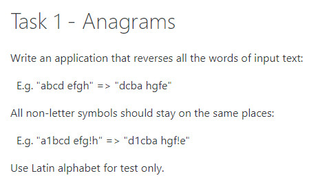
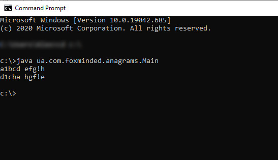
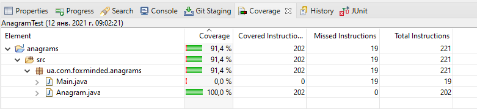

`Task 1 - Anagrams`

Write an application that reverses all the words of input text:

E.g. "abcd efgh" => "dcba hgfe"

All non-letter symbols should stay on the same places:

E.g. "a1bcd efg!h" => "d1cba hgf!e"

Use Latin alphabet for test only.




`Instuction how run applicatian Anagrams:`

Download and install java  https://www.java.com/ru/download/manual.jsp

Your mast put file Main.java and Anagram.java in 
>*\ua\com\foxminded\anagrams\

For exampl 

>C:\ua\com\foxminded\anagrams\

* Run Command Prompt

 >set path=%path%;C:\Program Files\Java\jdk1.*.*\bin

* This tells the system where to find JDK programs.

 >javac C:\ua\com\foxminded\anagrams\*.java*

* This runs javac.exe, the compiler. You should see nothing but the next system prompt...

 >C:\ua\com\foxminded\anagrams\
```
javac has created the Anagram.class and Main.class file. You should see Main.java, Anagram.java and Main.class, Anagram.class among the files.
```

* This makes C:\ the current directory.

 >cd C:\

* This runs the Java interpreter. Then you can input sentence.

>java ua.com.foxminded.anagrams.Main


```
If the system cannot find javac, check the set path command. If javac runs but you get errors, cell developers.
```
* You version.


`Task 2 - Unit tests`

Write JUnit tests for previous application.

 *In the future, all tasks are done with the Unit tests*
 
 


